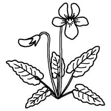
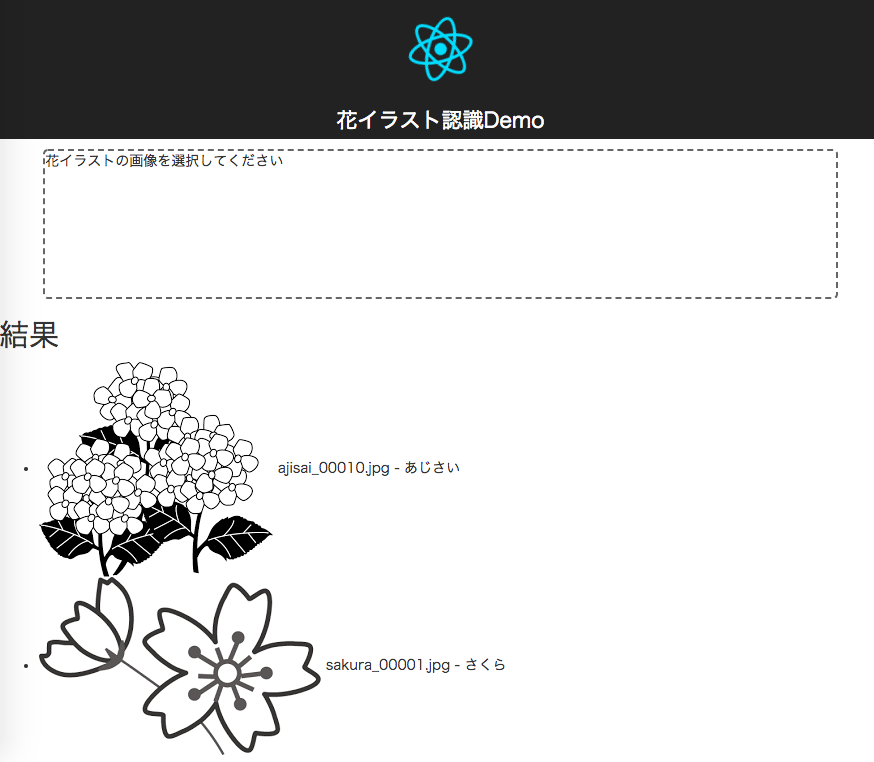

# 花イラスト認識AIを作ってみた


## きっかけ

みなさん、これは何の花かな？
長男の幼稚園の宿題で、私は回答できなかった。



花認識アプリはあるかは探してみたが、
写真はともかく、イラストを認識する良いアプリが見つからなかった

で、自作してみた

## こんな感じ



## 実現の仕方

* keras、tensorflowの基本画像認識のソースコードを参考[1]
* 花のイラストを200ほど枚収集
  * あじさい、すみれ、すいせん、さくら
* 認識精度向上のため ResNetモデルを利用
  * 正解率69% 通常のCNN(Convolutional Neural Network) [2]
  * 正解率87% ResNetの場合(Residual Network) [3]
* 訓練済みのモデルを利用しrest apiを作成 (python flask)
* フロントエンドはreactで作成

## ソースコード

### 前提

* python3 anaconda インストール済み
* tensorflow インストール済み
* keras インストール済み
* npm インストール済み
* vscode (オプション)

### web appを立ち上げる

```shell
$ cd ./keras_flower/webapp
$ python3 image_train.py
$ python3 image_web.py
$ open http://localhost:5000
```

### modelを訓練する

```shell
$ python3 image_train.py
# 15分ほど掛かるかも
```

以下の訓練用データは自分で用意してください
（画像は権利があるので）

```shell
data/train
data/test
```


## Dockerで動かす

```shell
$ docker build -t keras_flower .
$ docker run -d -p 5000:5000 --name=keras_flower keras_flower
$ open http://localhost:5000

```


## 参考

* [1] <https://github.com/keras-team/keras/blob/master/examples/README.md#vision-models-examples>
* [2] <https://github.com/keras-team/keras/blob/master/examples/mnist_cnn.py>
* [3] <https://github.com/keras-team/keras/blob/master/examples/cifar10_resnet.py>

